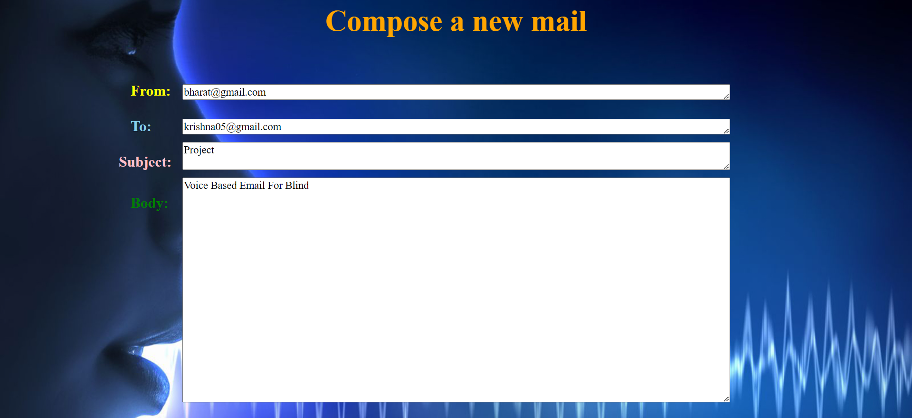
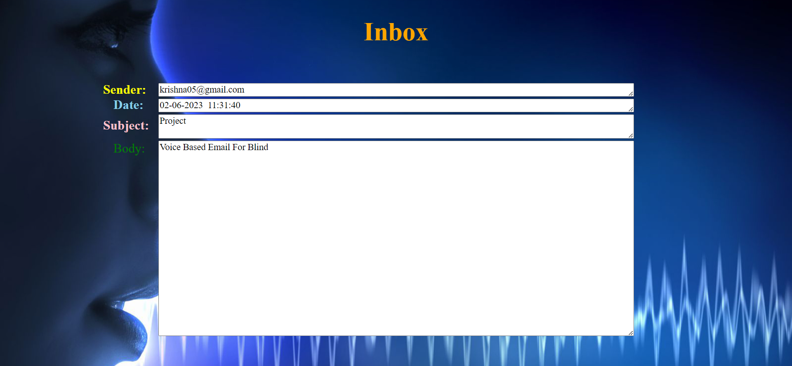

# VOICE-BASED-EMAIL-FOR-VISUALLY-CHALLENGED

This project aims at developing an email system that will help even a visually impaired person to use email services for communication.

## Project Introduction

Communication is one of the main fields highly changed by the Internet. E-mails are the most dependable way of communication over the Internet for sending and receiving important information. 

A survey has shown that there are more than 240 million visually impaired people around the globe. That is, around 240 million people are unaware of how to use the Internet or E-mail. This system aims at developing an email system that will help even a visually impaired person to use the services for communication without previous training.

The system is completely built on interactive voice response, making it user-friendly and efficient to use. The entire project is based on voice interaction, which means speech recognition.

## Technologies

- **Django Framework**
- **Frontend**: HTML, JavaScript, CSS
- **Backend**: Python
- **Database**: MySQL

## Results

### Welcome Page

The welcome page of the system will be displayed as below, which asks users to register or log in through speech.


### Registration Page

New users need to register to the system by speaking their Email ID and password.


### Login Page

Registered users can log in by speaking out their Email ID and password.


### Home Page

If the user details are valid, it will redirect to the Home page. Here, the user can compose a new mail, access the Inbox, or log out from the system.


### Compose Page

Here, the user is allowed to compose a mail by giving recipient name, subject, and message in the form of speech.



### Inbox Page

Here, the user can access the mails that are received in the form of voice.



## Getting Started

Follow these steps to set up and use our voice-based email system:

1. **Clone the Repository**:

   ```bash
   git clone https://github.com/your-username/your-repository.git
   cd your-repository
   ```

2. **Install Dependencies**:

   ```bash
   pip install -r requirements.txt
   ```

3. **Apply Migrations**:

   ```bash
   python manage.py migrate
   ```

4. **Start the Application**:

   ```bash
   python manage.py runserver
   ```

5. **Access the Welcome Page**:

   Open your web browser and navigate to `http://localhost:8000` to access the welcome page and begin the registration or login process.

## Contributing

We welcome contributions to enhance our system. Please follow these steps to contribute:

1. Fork the repository.
2. Create a new branch for your feature or bug fix.
3. Commit your changes and push your branch to GitHub.
4. Open a pull request with a detailed description of your changes.